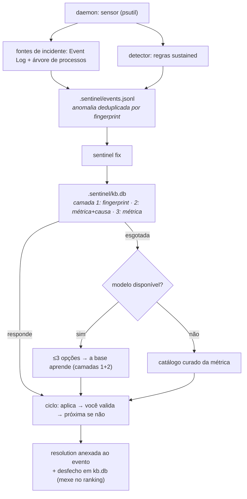

# Sentinel


**O satélite de vigilância do Theroverse — fica de olho na saúde da
máquina e, quando algo sai do trilho, monta um mini tutorial de
correção.**

O Sentinel monitora CPU, RAM, disco e rede em background, e fica de olho em
falhas reais: app que trava, app que morre deixando processos órfãos. Quando
detecta um pico sustentado, um gargalo, um volume quase cheio ou um desses
episódios, ele grava uma anomalia localmente. Aí você roda `sentinel fix` e
o Sentinel gera até **3 opções de solução** em passos curtos — perguntando
primeiro à base de conhecimento que ele mantém na sua máquina, e só a um
modelo quando a base já não tem o que dizer. Você testa cada uma e diz se
funcionou; se não, ele registra a recusa e passa pra próxima. É autocorreção
**guiada**: quem decide e executa é você, e o que funcionou fica aprendido.

Parte de uma suíte: o Sentinel é um dos satélites ao lado do
[Aegis](https://github.com/theroverse) (rede/firewall), e conversa com o
resto do ecossistema orbitando o
[Thero](https://github.com/theroverse/thero).

## Por que usar

- **Você não fica olhando o Gerenciador de Tarefas o dia todo.** O daemon
  amostra os recursos em silêncio; só te avisa quando algo é *sustentado*
  (não um pico de meio segundo de um app abrindo).
- **Ele também vê o que quebrou, não só o que está pesado.** App que parou
  de funcionar, app que travou e o Windows o fechou, processo que saiu
  deixando filhos órfãos: tudo vira anomalia no mesmo histórico, com a
  árvore mapeada e o módulo/código da exceção anotados.
- **Uma correção antes de um reboot aleatório.** Em vez de "feita a
  bagunça, reinicia", o Sentinel aponta o processo suspeito e sugere o
  caminho concreto pra resolver — fechar, adiar varredura, liberar disco.
- **Ele aprende o que funcionou na *sua* máquina.** A sugestão vem primeiro
  da base local (`.sentinel/kb.db`): a anomalia exata que você já viu, depois
  a mesma causa, por último o catálogo da métrica. Cada "funcionou / não
  funcionou" seu reordena a resposta da próxima vez.
- **Privacidade estrita, 100% local.** Nada de telemetria. A única saída
  de rede é a ponte com o modelo, disparada **só quando você roda** `sentinel
  fix` **e** a base já esgotou o que tinha a dizer sobre aquela anomalia. Sem
  ponte, ele responde da base curada. O daemon nunca chama IA.
- **Seguro por construção.** `sentinel kill` nunca encerra processo do
  sistema (lista protegida), recusa matar a si mesmo, mostra a árvore de
  processos e pede confirmação explícita — e só funciona numa sessão
  interativa.

## Requisitos

- Python 3.10+
- **psutil** (`pip install psutil`) — única dependência de runtime, usada
  pra ler as métricas localmente
- Um modelo pra fechar a escada (hoje: Claude Code via `claude -p`) —
  **opcional, e raro**: só é consultado quando a base local já esgotou o que
  tinha a dizer sobre aquela anomalia. Sem ele, o Sentinel responde da base
  curada e continua aprendendo com seus desfechos. (O motor local da fase
  seguinte é o Ollama compartilhado com a Athena — ver `docs/superpowers/`.)

## Instalação

```
git clone https://github.com/theroverse/sentinel.git
cd sentinel
pip install psutil
python sentinel.py --help
```

## Uso

```
python sentinel.py start              # daemon de vigilância em background
python sentinel.py status             # vivo? última amostra? N abertas
python sentinel.py events --open-only # anomalias registradas
python sentinel.py fix                # tutorial guiado da mais recente
                                      # (pergunta à base local antes de qualquer modelo)
python sentinel.py kb                 # o que a base já aprendeu
python sentinel.py kill <PID>         # encerra um processo-problema (seguro)
python sentinel.py stop               # encerra o daemon
```


Tudo que o Sentinel escreve fica numa pasta `.sentinel/` na raiz escolhida
(`--dir`, padrão: pasta atual): eventos, base de conhecimento, pidfile e
log. Nada sai da sua máquina por conta própria.

### Ciclo de feedback (`fix`)

```
anomalia aberta  ──►  PROPOSE  (pergunta à base local; só depois o modelo)
                     └─► RENDER opção i ──► AWAIT_VALIDATE
                                              ├─ "funcionou?" sim ──► RESOLVED (grava resolução + ranking)
                                              ├─ "não" ────────────► próxima opção (i++), e a recusa é registrada
                                              └─ "pular" / esgotadas ► DISMISSED
```

Cada decisão é humana (tty). Sem tty — ex.: rodando por um agente de IA —
o Sentinel apenas **exibe** as opções e sai, sem travar esperando tecla e
sem marcar nada como resolvido.

## Como funciona



### Além dos limiares: falha de app e processos órfãos

Duas anomalias não nascem de percentual, e sim de *evento*. Ambas entram no
mesmo histórico, com o mesmo dedupe e o mesmo ciclo de `fix`:

- **`app_failure`** — o Sentinel lê o Event Log *Application* com
  `wevtutil` (só os IDs 1000 "parou de funcionar" e 1002 "parou de
  responder", este último filtrado por provedor — o do Winlogon não é app
  nenhum; o 1001 é espelho do WER e fica de fora porque é ruído). No crash
  traz módulo e código da exceção; no hang, o fechamento pelo Windows. Ler
  o log não exige admin.
- **`orphan_tree`** — a cada batimento o Sentinel tira uma fotografia
  `{pid, ppid, nome, create_time}` dos processos. Quando um pai morre e
  filhos sobrevivem, ele registra o episódio e **mapeia a árvore inteira**
  (pid, pai declarado e profundidade de cada nó). Um único sobrevivente é
  `info` (costuma ser desapego proposital: o instalador que se desanexa);
  dois ou mais é `warning`, a assinatura de vazamento de árvore.
  `create_time` entra na identidade porque PID é reciclado no Windows. Só o
  ancestral morto mais alto reporta — sem a mesma árvore contada duas vezes.

Nenhum dos dois oferece `kill_top_process` automático: um incidente não tem
"processo mais caro", e a decisão é sempre sua.

### A base de conhecimento local (`.sentinel/kb.db`)

`fix` não pergunta primeiro a um modelo: pergunta à sua própria história. A
base é SQLite (stdlib) no território do Sentinel, quatro tabelas —
`anomaly_type`, `option`, `type_option` (quais opções pertencem a qual tipo,
e em que ordem) e `outcome` (o desfecho de cada tentativa). O daemon
não a toca: ele só grava `events.jsonl`; o `kb.db` nasce no primeiro `fix`,
e quem registra desfecho é você, ao validar.

A consulta sobe uma escada de especificidade e para na primeira que responde:

| Camada | Chave do tipo | O que é |
| --- | --- | --- |
| 1 | `fp:<fingerprint>` | esta anomalia exata, com este processo, já vista |
| 2 | `causa:<métrica>+<causa>` | mesma métrica, mesma causa raiz |
| 3 | `metrica:<métrica>` | catálogo curado da métrica |
| 4 | — | um modelo, quando a base não tem o que dizer |

A **causa** é uma assinatura, não um sintoma: num crash é o módulo que
falhou (a mesma DLL derruba apps diferentes), num episódio de órfãos é o pai
que morreu, numa anomalia de limiar é o processo mais caro da amostra.

**O ranking é do fingerprint, não da métrica.** Cada opção é ordenada por
`fixes` conquistados *contra aquele fingerprint*, depois por recusas, e o
empate respeita a ordem do catálogo. Uma vitória contra o chrome não
embaralha a resposta sobre o blender, que ninguém tentou ainda.

**Camada esgotada.** Quando toda opção de uma camada já foi tentada contra
este fingerprint e nenhuma resolveu, aquela camada para de responder e a
consulta sobe. Sem essa regra a camada 3 sempre teria algo a dizer e o
modelo nunca rodaria — logo, nunca aprenderia.

**A base aprende.** O que um modelo responder entra como camada 1 e 2
mesclada ao catálogo, com a origem marcada (`curado` / `aprendido`). Da
próxima vez é conhecimento local, e nada é consultado fora da máquina.

**Tutorial assertivo, não página de suporte.** Cada opção carrega
`title` / `why` / `steps` / `proof` / `risk` / `reversible`: nomeia o
processo medido no evento, explica o mecanismo em vez de mandar "limpar a
RAM", diz como você vai saber que funcionou e declara se tem volta. Proibido
no catálogo (e há teste que varre): "geralmente", "pode ser que",
"recomendamos", "tente", e passo que só abre uma janela de configurações sem
dizer o que mudar ali. Os valores medidos entram por token (`{proc}`,
`{pid}`, `{rss}`, `{value}`, `{threshold}`, `{module}`, `{parent}`…)
resolvidos na leitura, nunca congelados no banco.

No primeiro uso a base vem com 7 tipos e 21 opções curadas. O que importa é
o número seguinte: quantas delas foram *aprendidas* depois.

Para você conferir, não para acreditar:

```
python sentinel.py fix --explain-source   # de onde veio e o que pesou no ranking
python sentinel.py kb                     # tipos, opções, aprendidas, desfechos
python sentinel.py kb --json              # os mesmos números para script
```

Se `kb` mostrar `aprendidas: 0` depois de semanas de uso, "a base aprende" é
uma frase de marketing — e é por isso que o comando existe.

## Comandos

| Comando | O que faz |
| --- | --- |
| `start` / `stop` | Liga/desliga o daemon de vigilância (pidfile em `.sentinel/daemon.pid`). |
| `status` | Diz se o daemon está vivo, o último batimento e quantas anomalias estão abertas. |
| `watch [--once]` | Roda a vigilância em primeiro plano (Ctrl+C para); `--once` faz um tick. |
| `events [--open-only] [--limit N] [--json]` | Lista anomalias. |
| `fix [ID]` | Ciclo de tutoria sobre uma anomalia (padrão: a mais recente aberta). `--explain-source` diz qual camada respondeu e o que pesou no ranking. |
| `kb [--json]` | Inventário da base local: tipos, opções (curadas × aprendidas) e desfechos por anomalia. |
| `kill <PID> [--tree]` | Encerra um processo com lista protegida + confirmação; `--tree` inclui descendentes. |
| `prune --older-than DIAS` | Apaga eventos antigos. |
| `config [--show-source]` | Mostra limiares ativos e caminhos. |

Flags globais: `--dir PASTA`, `--quiet`, `--version`.

## Limiares (padrão)

Amostragem a cada **2s**, janela de **30 amostras** (~60s). O detector fica
mudo até **10** amostras acumuladas (nada de falso-positivo no boot).

| Métrica | Aviso | Crítico | Sustentação |
| --- | --- | --- | --- |
| CPU (%) | 85 | 95 | 5 amostras |
| RAM (%) | 80 | 93 | 5 amostras (crítico imediato) |
| Disco (%) | 85 | 95 | imediato |
| IO wait (%) | 70 | 90 | 8 amostras |
| Rede (bytes/s) | 0,8 × p95 histórico | — | 3 amostras (só informativo) |

Rede **não** tem crítico: banda alta é contexto, não falha. Ajuste tudo
por `.sentinel/config.json` (ex.: `{"CPU_WARNING": 90}`) — o `sentinel
config --show-source` mostra o que foi sobrescrito.

## Formato do evento (`.sentinel/events.jsonl`)

Append-only, uma linha = um JSON. Dois tipos: `anomaly` e `resolution`
(ligada por `ref`).

```json
{"schema": 1, "id": "evt-20260921-142031-a3f1", "ts": "2026-09-21T14:20:31+00:00",
 "kind": "anomaly", "metric": "cpu", "severity": "critical", "value": 97.4,
 "threshold": 95.0, "window": {"samples": 30, "span_s": 60.0},
 "top_processes": [{"pid": 1234, "name": "chrome", "cpu": 62.1, "rss_mb": 1840.0}],
 "status": "open", "fingerprint": "cpu:critical:chrome"}
```

`status`: `open → addressing → (resolved | dismissed)`. `fingerprint` é a
chave de deduplicação (mesma métrica+severidade+processo numa janela de
5min atualiza `occurrences` em vez de poluir o log). `top_processes` guarda
só pid/nome/uso — nunca cmdline nem caminhos do usuário.

Schema 2 é a linha de um incidente (`app_failure`, `orphan_tree`): sem
`value`/`threshold`/`top_processes`, porque não existe limiar nem "processo
mais caro" num crash. Em vez de zeros fingindo número, carrega `label` (uma
linha, pro log e pro CLI) e `detail` (o que a GUI e o tutorial citam).

```json
{"schema": 2, "id": "evt-20260922-031207-9c2d", "ts": "2026-09-22T03:12:07+00:00",
 "kind": "anomaly", "metric": "orphan_tree", "severity": "warning",
 "label": "setup (pid 8124) saiu deixando 2 processo(s) vivo(s) na árvore",
 "detail": {"parent": {"pid": 8124, "name": "setup"},
            "orphans": [{"pid": 8300, "ppid": 8124, "name": "installer", "depth": 1}],
            "orphan_count": 1,
            "tree": [{"pid": 8300, "ppid": 8124, "name": "installer", "depth": 1},
                     {"pid": 8412, "ppid": 8300, "name": "copy", "depth": 2}],
            "tree_size": 2},
 "status": "open", "fingerprint": "orphan_tree:warning:setup", "occurrences": 1}
```

O leitor é tolerante: arquivos gravados no schema 1 continuam legíveis ao
lado das linhas novas, sem migração.

A linha `resolution` diz de onde veio a sugestão que fechou o caso, no mesmo
vocabulário do `fix --explain-source`: `kb:fingerprint`, `kb:causa`,
`kb:metrica` ou `modelo`. É ela que permite auditoria — "resolveu" separado
de "quem sugeriu".

## Estrutura do projeto

```
sentinel/
├── sentinel.py             # ponto de entrada (python sentinel.py ...)
├── src/sentinel/
│   ├── cli.py              # argparse + despacho de comandos
│   ├── settings.py         # limiares, paths do .sentinel/, lista protegida
│   ├── sensor.py           # psutil → Sample (CPU/RAM/disco/rede/top procs)
│   ├── daemon.py           # start/stop/status + loop de vigilância
│   ├── detector.py         # regras sustained → Findings
│   ├── incidents.py        # fotografia da árvore → Incident (órfãos)
│   ├── appfail.py          # Event Log (wevtutil /f:xml) → Incident
│   ├── events.py           # EventStore JSONL (append + dedupe + resolução)
│   ├── kb.py               # catálogo curado por métrica + tokens do tutorial
│   ├── kbstore.py          # kb.db: camadas, ranking por fingerprint, aprendizado
│   ├── tutor.py            # máquina de estados do ciclo de feedback
│   ├── processctl.py       # árvore de processos + kill seguro
│   ├── prompts.py          # prompt do tutorial (≤3 opções, PT-BR)
│   ├── claude_client.py    # ponte `claude -p` + parse tolerante (camada 4)
│   └── system/
│       ├── process.py      # execução de comandos (Windows/POSIX)
│       └── prompt.py       # confirmação y/n (tty-aware)
├── tests/                  # pytest, com psutil falso + wevtutil falso (nada real)
├── requirements-dev.txt    # pytest, pytest-cov (psutil é runtime, não dev)
└── pytest.ini
```

## Testes

```
pip install -r requirements-dev.txt
python -m pytest
```

Os testes injetam um `psutil` fake e um executador de `wevtutil` fake: não
dependem de psutil real, não abrem processos reais, não matam nada e não
leem o Event Log da máquina. A base (`kb.db`) roda em SQLite de verdade
sobre um arquivo temporário — `sqlite3` é stdlib, não há o que simular, e um
fake de banco testaria o fake. Um teste varre o catálogo curado procurando
hedging proibido ("geralmente", "pode ser que", "recomendamos", "tente") e
token que não fecha; ou seja: conselho vago ou texto com `{rss}` solto
quebra a suíte. O teste marcado `live` (se adicionado) é o único que tocaria
uma ponte real e não roda no CI.

## Limitações conhecidas

- Um único disco "principal" é vigiado (não cada volume montado).
- `io_busy` no Windows é uma aproximação (tempo de IO agregado /
  wall-clock), não o contador nativo de % disk time.
- Rede é correlação informativa — nunca dispara tutorial sozinha.
- A camada 4 ainda é a ponte `claude -p`; o motor local (Ollama + um modelo
  só, compartilhado com a Athena) é a próxima fase do spec residente.
- A base não generaliza sozinha: uma vitória contada contra o `chrome` não
  vale pro `chromium`. fingerprints diferentes, históricos diferentes — é
  conservador de propósito, pra um processo não herdar a reputação do vizinho.
- O catálogo curado cobre as 7 espécies que o Sentinel sabe detectar
  (cpu/ram/disco/io/rede + falha de app + árvore órfã). Anomalia de fora
  disso não tem camada 3: depende da camada 4 pra ser aprendida.
- Falha de app é lida do Event Log *depois* do fato: o Sentinel registra e
  explica, não impede o crash.
- A árvore de órfãos é reconhecida por *transição* entre amostras: um
  processo que morre e deixa filhos entre dois batimentos. O primeiro
  batimento nunca emite nada (aquecimento).

## Autor

**Anthero Vieira Neto**

- E-mail: antherovn@gmail.com
- LinkedIn: https://www.linkedin.com/in/anthero-vieira-neto-aa7a6b8a
- GitHub: http://github.com/netovieira

## Licença

[MIT](./LICENSE)
