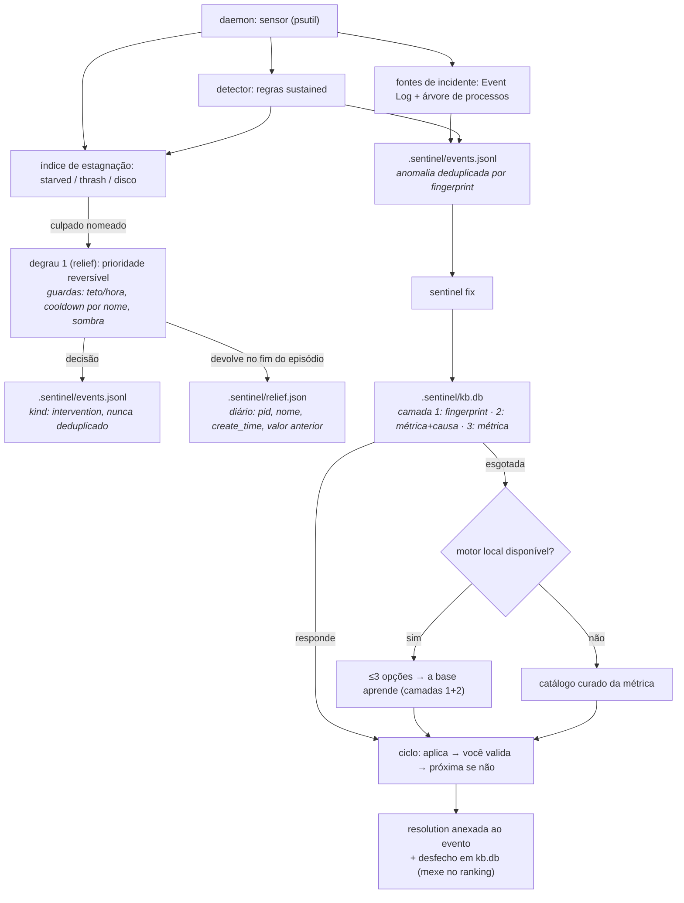

# Sentinel


**O satélite de vigilância do Theroverse — fica de olho na saúde da
máquina e, quando algo sai do trilho, monta um mini tutorial de
correção.**

O Sentinel monitora CPU, RAM, disco e rede em background, e fica de olho em
falhas reais: app que trava, app que morre deixando processos órfãos. Quando
detecta um pico sustentado, um gargalo, um volume quase cheio ou um desses
episódios, ele grava uma anomalia localmente. Aí você roda `sentinel fix` e
o Sentinel gera até **3 opções de solução** em passos curtos — perguntando
primeiro à base de conhecimento que ele mantém na sua máquina, e só a um
modelo quando a base já não tem o que dizer. Você testa cada uma e diz se
funcionou; se não, ele registra a recusa e passa pra próxima. É autocorreção
**guiada**: quem decide e executa é você, e o que funcionou fica aprendido.

Parte de uma suíte: o Sentinel é um dos satélites ao lado do
[Aegis](https://github.com/theroverse) (rede/firewall), e conversa com o
resto do ecossistema orbitando o
[Thero](https://github.com/theroverse/thero).

## Por que usar

- **Você não fica olhando o Gerenciador de Tarefas o dia todo.** O daemon
  amostra os recursos em silêncio; só te avisa quando algo é *sustentado*
  (não um pico de meio segundo de um app abrindo).
- **Ele também vê o que quebrou, não só o que está pesado.** App que parou
  de funcionar, app que travou e o Windows o fechou, processo que saiu
  deixando filhos órfãos: tudo vira anomalia no mesmo histórico, com a
  árvore mapeada e o módulo/código da exceção anotados.
- **Uma correção antes de um reboot aleatório.** Em vez de "feita a
  bagunça, reinicia", o Sentinel aponta o processo suspeito e sugere o
  caminho concreto pra resolver — fechar, adiar varredura, liberar disco.
- **Ele aprende o que funcionou na *sua* máquina.** A sugestão vem primeiro
  da base local (`.sentinel/kb.db`): a anomalia exata que você já viu, depois
  a mesma causa, por último o catálogo da métrica. Cada "funcionou / não
  funcionou" seu reordena a resposta da próxima vez.
- **Privacidade estrita, 100% local.** Nada de telemetria. A única saída
  de rede é a pergunta a um **modelo nesta mesma máquina** (loopback),
  disparada **só quando você roda** `sentinel fix` **e** a base já esgotou o
  que tinha a dizer sobre aquela anomalia. Um endereço que não seja a sua
  própria máquina é **recusado no código**, não na config — sem exceção para
  IA paga. Sem motor, ele responde da base curada. O daemon nunca chama IA.
- **Seguro por construção.** `sentinel kill` nunca encerra processo do
  sistema (lista protegida), recusa matar a si mesmo, mostra a árvore de
  processos e pede confirmação explícita — e só funciona numa sessão
  interativa.

## Requisitos

- Python 3.10+
- **psutil** (`pip install psutil`) — única dependência de runtime, usada
  pra ler as métricas localmente
- Um **modelo local** pra fechar a escada — **opcional, e raro**: só é
  consultado quando a base local já esgotou o que tinha a dizer sobre aquela
  anomalia. Qualquer servidor na sua máquina serve: Ollama
  (`http://127.0.0.1:11434`) ou um endpoint OpenAI-compatível (LM Studio,
  llama.cpp server). O Sentinel **não instala nem baixa nada** — quem provê
  o motor é você; `sentinel model status` diz o que ele encontrou. Sem motor,
  o `fix` responde da base curada e continua aprendendo com seus desfechos.

O endereço e o nome do modelo se escolhem por variável de ambiente
(`SENTINEL_OLLAMA_HOST`, `SENTINEL_OLLAMA_MODEL`) ou por
`.sentinel/config.json` (`"ollama_host"`, `"ollama_model"`); o padrão é
`http://127.0.0.1:11434` com `qwen3-coder-next`. Host fora de loopback é
recusado, venha ele da env ou do config.

## Instalação

```
git clone https://github.com/theroverse/sentinel.git
cd sentinel
pip install psutil
python sentinel.py --help
```

## Uso

```
python sentinel.py start              # daemon de vigilância em background
python sentinel.py status             # vivo? última amostra? N abertas
python sentinel.py events --open-only # anomalias registradas
python sentinel.py fix                # tutorial guiado da mais recente
                                      # (pergunta à base local antes de qualquer modelo)
python sentinel.py kb                 # o que a base já aprendeu
python sentinel.py model status       # o motor local está vivo? anuncia o modelo?
python sentinel.py kill <PID>         # encerra um processo-problema (seguro)
python sentinel.py relief <PID>       # rebaixa a prioridade (degrau 1, na sua mão)
python sentinel.py orders             # o que o Sentinel faz sozinho, e com que teto
python sentinel.py pause              # para de registrar (kill-switch)
python sentinel.py resume             # retoma
python sentinel.py stop               # encerra o daemon
```


Tudo que o Sentinel escreve fica numa pasta `.sentinel/` na raiz escolhida
(`--dir`, padrão: pasta atual): eventos, base de conhecimento, pidfile e
log. Nada sai da sua máquina por conta própria.

### Ciclo de feedback (`fix`)

```
anomalia aberta  ──►  PROPOSE  (pergunta à base local; só depois o modelo)
                     └─► RENDER opção i ──► AWAIT_VALIDATE
                                              ├─ "funcionou?" sim ──► RESOLVED (grava resolução + ranking)
                                              ├─ "não" ────────────► próxima opção (i++), e a recusa é registrada
                                              └─ "pular" / esgotadas ► DISMISSED
```

Cada decisão é humana (tty). Sem tty — ex.: rodando por um agente de IA —
o Sentinel apenas **exibe** as opções e sai, sem travar esperando tecla e
sem marcar nada como resolvido.

### Pausar sem interface: `sentinel pause`

O interruptor é um arquivo: enquanto `.sentinel/paused` existir, o daemon
**amostra, emite batimento e não registra nada** — e, desde o degrau 1, também
não age: o agente de alívio nem é consultado. Ele é lido a cada ciclo,
então vale também para o daemon que já está rodando, sobrevive a reboot e não
depende de janela aberta — que é o requisito de um kill-switch.

Pausar é **mudo, não fila**: o que aconteceu durante a pausa não volta no
`resume`. Um processo que nasceu e morreu entre dois batimentos só existe
como diferença *aquele* par de batimentos, e o detector continua acumulando
para que a sustentação esteja certa no primeiro tick livre. Cada virada
aparece no `daemon.log` (`VIGILANCIA PAUSADO` / `VIGILANCIA ATIVO`) para o
histórico nunca ter um buraco sem explicação.

## Como funciona



### Além dos limiares: falha de app e processos órfãos

Duas anomalias não nascem de percentual, e sim de *evento*. Ambas entram no
mesmo histórico, com o mesmo dedupe e o mesmo ciclo de `fix`:

- **`app_failure`** — o Sentinel lê o Event Log *Application* com
  `wevtutil` (só os IDs 1000 "parou de funcionar" e 1002 "parou de
  responder", este último filtrado por provedor — o do Winlogon não é app
  nenhum; o 1001 é espelho do WER e fica de fora porque é ruído). No crash
  traz módulo e código da exceção; no hang, o fechamento pelo Windows. Ler
  o log não exige admin.
- **`orphan_tree`** — a cada batimento o Sentinel tira uma fotografia
  `{pid, ppid, nome, create_time}` dos processos. Quando um pai morre e
  filhos sobrevivem, ele registra o episódio e **mapeia a árvore inteira**
  (pid, pai declarado e profundidade de cada nó). Um único sobrevivente é
  `info` (costuma ser desapego proposital: o instalador que se desanexa);
  dois ou mais é `warning`, a assinatura de vazamento de árvore.
  `create_time` entra na identidade porque PID é reciclado no Windows. Só o
  ancestral morto mais alto reporta — sem a mesma árvore contada duas vezes.

Nenhum dos dois oferece `kill_top_process` automático: um incidente não tem
"processo mais caro", e a decisão é sempre sua.

### Quando a máquina trava: o índice de estagnação (`stall`)

Recurso alto não é prova de nada — build rodando a 99% de CPU é build
rodando. O que muda o diagnóstico é o **atraso que a máquina passa a ter pra
si mesma**, e isso o Sentinel mede a cada batimento com três sinais locais:

| sinal | o que é medido | por que é travamento |
| --- | --- | --- |
| `starved` | quanto o `sleep(2,0)` do daemon **realmente** demorou | se a máquina não escala nem quem só dorme, nada mais é escalado |
| `thrashing` | carga de commit (no Windows, o `percent` do pagefile **é** o commit) e, onde o psutil mede, páginas trocadas por segundo | o paginador virou o gargalo; a 90% do limite o Windows já recorda reserva |
| `disk_saturated` | `%` de tempo do disco ocupado com I/O, sustentado | todo mundo esperando disco |

A regra é de **combinação**, e é ela que evita o falso-positivo: estagnação
é (qualquer um dos três) **e** pelo menos um processo candidato em crítico
sustentado — o mesmo processo, pelo nome, em dois batimentos seguidos.
Pressão sem culpado é clima; crítico sem pressão é carga de trabalho pedida.
Processo protegido (`svchost`, `csrss`, ...) e o próprio Sentinel nunca são
candidatos.

O que o índice faz com o loop, e só isso:

- **encurta o próprio intervalo** de 2,0 s para 0,5 s enquanto há suspeita,
  pra ver o episódio passar por dentro e saber a hora exata em que acabou;
- **grava um evento por episódio** (não por tick), com os números medidos
  dentro do `detail` — é o que permite ao tutorial citar "o sleep de 2 s do
  daemon levou 6.1 s" em vez de dizer "o sistema está lento";
- marca o batimento com `stall=1` e, no fim, escreve
  `ESTAGNACAO CESSOU dur=… ticks=… sinais=…` no `daemon.log`.

Ele **não age**: mexer no sistema é o degrau 1 (`relief`), que lê o que esta
medição produziu. Sob `pause`, o índice continua medindo e o intervalo
continua encurtando, mas nenhuma linha vai pro histórico.

O catálogo curado da métrica tem três opções, nenhuma com `action` automática
no `fix` (o tutor apresenta e você executa): rebaixar a prioridade do culpado
no PowerShell da sua sessão, sem admin e sem fechar nada — exatamente o que o
degrau 1 já faz sozinho quando o nomeia (`relief`, abaixo); ceder working set
fechando janelas quando o sinal que abriu o episódio foi a paginação; e
procurar recorrência no mesmo relógio, que é o que separa carga de trabalho
de tarefa agendada. A frase de prova (`{evidence}`) é montada **só** com os
números daquele episódio — no Windows, onde o psutil devolve `sin`/`sout`
zerados, ela cita a carga de commit em vez de uma taxa que seria "0".

### O degrau 1: alívio reversível (`relief`)

Medir é a metade honesta do trabalho; a outra metade é tirar o peso de cima
no momento crítico **sem destruir nada**. O degrau 1 faz uma coisa só: baixa a
classe de prioridade do processo nomeado pelo índice de estagnação para
`abaixo-do-normal`. Ele continua rodando — só para de passar na frente de
todo mundo. Nada é fechado, nada é reiniciado, e o Windows devolve o que era
quando o Sentinel devolve.

A escada completa, e o que está ligado hoje:

| degrau | ação | estado |
| --- | --- | --- |
| 1 | rebaixar prioridade do culpado | **ligado desde o primeiro dia**, sem ordem e sem selo |
| 2 | teto de CPU por job | exige ordem por app (fase E) |
| 3 | encerrar árvore do culpado | exige ordem por app (fase E) |
| — | teto de RAM | **nunca automático**: só aparece no tutorial, e você executa |

Rebaixar é automático porque é reversível, imediato e não perde trabalho: o
pior caso é um build terminar mais tarde. Fechar processo não tem essa
garantia, e por isso os degraus 2 e 3 continuam pedindo autorização.

**As guardas** (limite de intervenção, não de confiança):

- **teto de uma hora** — no máximo `RELIEF_HOUR_LIMIT` (3) intervenções por
  hora. Cada decisão conta, inclusive as que o modo sombra só simulou: o
  teto existe pra limitar o que o Sentinel *decidiu*, não o que ele tocou.
- **cooldown por app** — `RELIEF_APP_COOLDOWN_S` (600 s) sem repetir o mesmo
  **nome**. É por nome e não por PID porque PID é reciclado: o processo novo
  não deve sair impune, e o antigo não deve ser punido duas vezes.
- **`paused`** — com a vigilância pausada o agente não é nem consultado. Ele
  devolve o que estiver rebaixado ao encerrar, e o histórico não ganha linha.
- **lista protegida e o próprio Sentinel** — recusados sempre, no automático e
  no manual (`is_protected` / `is_self`).
- **limite declarado, não furado** — `AccessDenied` vira `sem-alcance` no
  log. Não há UAC, não há serviço, não há elevação em nenhum componente: o
  que o Sentinel não alcança com o seu usuário, ele diz que não alcança.

**Devolver.** Cada rebaixamento aplicado entra no diário
`.sentinel/relief.json` com pid, nome e o valor de prioridade anterior, e o
`create_time` do processo — é o que prova que o pid de agora é o mesmo
processo de antes. Um pid que sumiu e foi reciclado **nunca** é devolvido: o
diário é lido, a identidade confere ou a ação não acontece. O revert dispara
no fim do episódio, e o que um daemon morto deixou rebaixado volta no primeiro
tick do daemon novo (`recover`).

**Modo sombra** (`orders shadow --on`): o Sentinel calcula, decide e grava
cada intervenção como `SERIA …` sem tocar em processo nenhum. Não é o padrão
— o degrau 1 age desde o início — mas é a única forma de ver o que ele faria
antes de decidir confiar nele. Sombra não prende o que já foi aplicado: o
revert continua valendo mesmo com o modo ligado.

Você pode agir no mesmo degrau com a sua mão:

```
sentinel relief <PID>              # rebaixa, sem passar pelas guardas
sentinel relief <PID> --restore    # devolve o valor que estava no histórico
sentinel orders                    # o que está autorizado, com que teto
sentinel events --interventions    # a auditoria: uma linha por decisão
```

Toda intervenção vira uma linha `kind: "intervention"` no `events.jsonl`, com
`ref` apontando para a anomalia `stall` do episódio. Essa linha **não é
deduplicada** — o registro do que foi feito é justamente o que compra a
confiança para os degraus 2 e 3. Depois de agir, o episódio passa de `open`
para `addressing`, e para aí: quem diz que resolveu é você, no ciclo de
validação do `fix`.

### A base de conhecimento local (`.sentinel/kb.db`)

`fix` não pergunta primeiro a um modelo: pergunta à sua própria história. A
base é SQLite (stdlib) no território do Sentinel, quatro tabelas —
`anomaly_type`, `option`, `type_option` (quais opções pertencem a qual tipo,
e em que ordem) e `outcome` (o desfecho de cada tentativa). O daemon
não a toca: ele só grava `events.jsonl`; o `kb.db` nasce no primeiro `fix`,
e quem registra desfecho é você, ao validar.

A consulta sobe uma escada de especificidade e para na primeira que responde:

| Camada | Chave do tipo | O que é |
| --- | --- | --- |
| 1 | `fp:<fingerprint>` | esta anomalia exata, com este processo, já vista |
| 2 | `causa:<métrica>+<causa>` | mesma métrica, mesma causa raiz |
| 3 | `metrica:<métrica>` | catálogo curado da métrica |
| 4 | — | um **modelo local** (loopback), quando a base não tem o que dizer |

A **causa** é uma assinatura, não um sintoma: num crash é o módulo que
falhou (a mesma DLL derruba apps diferentes), num episódio de órfãos é o pai
que morreu, numa anomalia de limiar é o processo mais caro da amostra.

**O ranking é do fingerprint, não da métrica.** Cada opção é ordenada por
`fixes` conquistados *contra aquele fingerprint*, depois por recusas, e o
empate respeita a ordem do catálogo. Uma vitória contra o chrome não
embaralha a resposta sobre o blender, que ninguém tentou ainda.

**Camada esgotada.** Quando toda opção de uma camada já foi tentada contra
este fingerprint e nenhuma resolveu, aquela camada para de responder e a
consulta sobe. Sem essa regra a camada 3 sempre teria algo a dizer e o
modelo nunca rodaria — logo, nunca aprenderia.

**A base aprende.** O que um modelo responder entra como camada 1 e 2
mesclada ao catálogo, com a origem marcada (`curado` / `aprendido`). Da
próxima vez é conhecimento local, e nada é consultado fora da máquina.

**Tutorial assertivo, não página de suporte.** Cada opção carrega
`title` / `why` / `steps` / `proof` / `risk` / `reversible`: nomeia o
processo medido no evento, explica o mecanismo em vez de mandar "limpar a
RAM", diz como você vai saber que funcionou e declara se tem volta. Proibido
no catálogo (e há teste que varre): "geralmente", "pode ser que",
"recomendamos", "tente", e passo que só abre uma janela de configurações sem
dizer o que mudar ali. Os valores medidos entram por token (`{proc}`,
`{pid}`, `{rss}`, `{value}`, `{threshold}`, `{module}`, `{parent}`…)
resolvidos na leitura, nunca congelados no banco.

No primeiro uso a base vem com 7 tipos e 21 opções curadas. O que importa é
o número seguinte: quantas delas foram *aprendidas* depois.

Para você conferir, não para acreditar:

```
python sentinel.py fix --explain-source   # de onde veio e o que pesou no ranking
python sentinel.py kb                     # tipos, opções, aprendidas, desfechos
python sentinel.py kb --json              # os mesmos números para script
```

Se `kb` mostrar `aprendidas: 0` depois de semanas de uso, "a base aprende" é
uma frase de marketing — e é por isso que o comando existe.

### O motor local, e a ausência dele

`sentinel model status` responde três perguntas e nenhuma a mais: tem
qualquer coisa no endereço? que dialeto ele fala (Ollama ou OpenAI)? ele
anuncia o modelo pedido? É só leitura — o comando não instala runtime, não
baixa peso, não toca em arquivo nenhum. Provisionar é seu, e é uma decisão,
não um esquecimento: um processo residente que baixa gigabytes sozinho é o
tipo de coisa que faz um vigilante merecer desconfiança.

```
python sentinel.py model status           # vivo / dialeto / versão / modelo
python sentinel.py model status --json    # os mesmos campos para a GUI
```

A ausência não é um erro nem um degrau abaixo: o `fix` roda a camada 3 — o
catálogo curado — e diz `source=kb:metrica`. O que ele *não* faz é fingir que
há IA respondendo. E o veto é de código: um `SENTINEL_OLLAMA_HOST` apontando
para outra máquina faz o Sentinel recusar a pergunta, não obedecer.

## Comandos

| Comando | O que faz |
| --- | --- |
| `start` / `stop` | Liga/desliga o daemon de vigilância (pidfile em `.sentinel/daemon.pid`). |
| `status` | Diz se o daemon está vivo, o último batimento, se a vigilância está pausada, o estado do modo sombra e quantas anomalias estão abertas. |
| `pause` / `resume` | Kill-switch sem GUI: `.sentinel/paused` existe → o daemon amostra mas não registra nada (e não age). Sobrevive a reboot e a daemon morto. |
| `watch [--once]` | Roda a vigilância em primeiro plano (Ctrl+C para); `--once` faz um tick — e desliga o degrau 1 de propósito, pra um diagnóstico não correr na frente do daemon. |
| `events [--open-only] [--limit N] [--interventions] [--json]` | Lista anomalias; `--interventions` troca a lista pelo histórico de alívio. |
| `fix [ID]` | Ciclo de tutoria sobre uma anomalia (padrão: a mais recente aberta). `--explain-source` diz qual camada respondeu e o que pesou no ranking. |
| `kb [--json]` | Inventário da base local: tipos, opções (curadas × aprendidas) e desfechos por anomalia. |
| `model status [--json]` | Sonda o motor local: vivo? que dialeto? anuncia o modelo pedido? Só leitura — não instala nem baixa nada. |
| `kill <PID> [--tree]` | Encerra um processo com lista protegida + confirmação; `--tree` inclui descendentes. |
| `relief <PID> [--restore]` | Sua mão no degrau 1: rebaixa (ou devolve, com `--restore`, usando o valor anterior que está no histórico). Passa pelas recusas — lista protegida, processo morto, sem alcance — e **não** pelas guardas de teto/cooldown: quem mandou foi você. |
| `orders [shadow [--on\|--off]]` | Mostra o que está autorizado no caminho autônomo (degraus, guardas, ausência de elevação) e liga/desliga o modo sombra em `.sentinel/orders.json`. |
| `prune --older-than DIAS` | Apaga eventos antigos. |
| `config [--show-source]` | Mostra limiares ativos e caminhos. |

Flags globais: `--dir PASTA`, `--quiet`, `--version`.

## Limiares (padrão)

Amostragem a cada **2s**, janela de **30 amostras** (~60s). O detector fica
mudo até **10** amostras acumuladas (nada de falso-positivo no boot).

| Métrica | Aviso | Crítico | Sustentação |
| --- | --- | --- | --- |
| CPU (%) | 85 | 95 | 5 amostras |
| RAM (%) | 80 | 93 | 5 amostras (crítico imediato) |
| Disco (%) | 85 | 95 | imediato |
| IO wait (%) | 70 | 90 | 8 amostras |
| Rede (bytes/s) | 0,8 × p95 histórico | — | 3 amostras (só informativo) |

Rede **não** tem crítico: banda alta é contexto, não falha. Ajuste tudo
por `.sentinel/config.json` (ex.: `{"CPU_WARNING": 90}`) — o `sentinel
config --show-source` mostra o que foi sobrescrito.

Os sinais do índice de estagnação têm limiares próprios, e obedecem à mesma
regra de sobrescrita:

| Sinal | Limiar | Sustentação |
| --- | --- | --- |
| `starved` | `sleep` real ≥ 2× o pedido | 2 batimentos |
| `thrashing` | taxa de troca (`sin`+`sout`) ≥ 256/s **ou** commit ≥ 90% | 2 batimentos |
| `disk_saturated` | disco ocupado ≥ 95% | 3 batimentos |
| culpado em crítico | 1 processo elegível | 2 batimentos |
| intervalo sob suspeita | 2,0 s → **0,5 s** | enquanto durar |

No Windows o `thrashing` é carregado pelo **commit**: o psutil documenta que
`sin`/`sout` ali "não significam nada e ficam em 0" (medido: `sin=0
sout=0`), então a taxa só conta em Linux — onde a unidade segue o psutil da
plataforma, e por isso o número é configurável e não absoluto.

### Guardas do degrau 1

As guardas do degrau 1 também se sobrescrevem por `config.json`:

| Guarda | Padrão | O que limita |
| --- | --- | --- |
| `RELIEF_HOUR_LIMIT` | 3 | decisões de intervenção por hora (sombra conta junto) |
| `RELIEF_APP_COOLDOWN_S` | 600 s | repetição sobre o mesmo **nome** de app |
| `RELIEF_JOURNAL_MAX` | 50 | entradas vivas no diário `.sentinel/relief.json` |
| `RELIEF_NICE_STEP` | 10 | passo do `nice` em POSIX, onde não existe classe de prioridade |

## Formato do evento (`.sentinel/events.jsonl`)

Append-only, uma linha = um JSON. Três tipos: `anomaly`, `resolution`
(ligada por `ref`) e `intervention` — o que o degrau 1 decidiu, fez ou
deixou de fazer.

```json
{"schema": 1, "id": "evt-20260921-142031-a3f1", "ts": "2026-09-21T14:20:31+00:00",
 "kind": "anomaly", "metric": "cpu", "severity": "critical", "value": 97.4,
 "threshold": 95.0, "window": {"samples": 30, "span_s": 60.0},
 "top_processes": [{"pid": 1234, "name": "chrome", "cpu": 62.1, "rss_mb": 1840.0}],
 "status": "open", "fingerprint": "cpu:critical:chrome"}
```

`status`: `open → addressing → (resolved | dismissed)`. `fingerprint` é a
chave de deduplicação (mesma métrica+severidade+processo numa janela de
5min atualiza `occurrences` em vez de poluir o log). `top_processes` guarda
só pid/nome/uso — nunca cmdline nem caminhos do usuário.

Schema 2 é a linha de um incidente (`app_failure`, `orphan_tree`): sem
`value`/`threshold`/`top_processes`, porque não existe limiar nem "processo
mais caro" num crash. Em vez de zeros fingindo número, carrega `label` (uma
linha, pro log e pro CLI) e `detail` (o que a GUI e o tutorial citam).

```json
{"schema": 2, "id": "evt-20260922-031207-9c2d", "ts": "2026-09-22T03:12:07+00:00",
 "kind": "anomaly", "metric": "orphan_tree", "severity": "warning",
 "label": "setup (pid 8124) saiu deixando 2 processo(s) vivo(s) na árvore",
 "detail": {"parent": {"pid": 8124, "name": "setup"},
            "orphans": [{"pid": 8300, "ppid": 8124, "name": "installer", "depth": 1}],
            "orphan_count": 1,
            "tree": [{"pid": 8300, "ppid": 8124, "name": "installer", "depth": 1},
                     {"pid": 8412, "ppid": 8300, "name": "copy", "depth": 2}],
            "tree_size": 2},
 "status": "open", "fingerprint": "orphan_tree:warning:setup", "occurrences": 1}
```

O leitor é tolerante: arquivos gravados no schema 1 continuam legíveis ao
lado das linhas novas, sem migração.

A linha `resolution` diz de onde veio a sugestão que fechou o caso, no mesmo
vocabulário do `fix --explain-source`: `kb:fingerprint`, `kb:causa`,
`kb:metrica` ou `modelo`. É ela que permite auditoria — "resolveu" separado
de "quem sugeriu".

A linha `intervention` é o caderno do degrau 1: uma por decisão, nunca
deduplicada mesmo quando o processo é o mesmo, porque o que está sob auditoria
é a conduta, não o fato.

```json
{"schema": 2, "id": "int-20260922-181904-89ea", "ts": "2026-09-22T18:19:04+00:00",
 "kind": "intervention", "metric": "priority_below_normal",
 "action": "priority_below_normal", "reason": "ok", "shadow": false,
 "applied": true, "ref": "evt-20260922-181857-4b21",
 "label": "FEZ chrome (pid 8124): prioridade -> abaixo-do-normal [ok]",
 "detail": {"action": "priority_below_normal",
            "target": {"pid": 8124, "name": "chrome"},
            "priority": {"from": "normal", "from_raw": 32,
                         "to": "abaixo-do-normal", "to_raw": 16384},
            "reason": "ok", "shadow": false}}
```

`applied` é a verdade da linha: `false` com `reason` `modo-sombra`,
`teto-de-uma-hora`, `cooldown-do-app`, `processo-protegido`,
`processo-inalcancavel`, `sem-alcance` ou `sem-alavanca` diz o que o Sentinel
deixou de fazer e por quê. `ref` aponta para a anomalia do episódio — no
caminho manual (`sentinel relief <PID>`) é a string `manual`. O `*_raw` é o
número da plataforma, e é dele que o `relief <PID> --restore` precisa: sem
`from_raw` não existe "devolver".

As quatro ações possíveis são `priority_below_normal`, `priority_restored`,
`priority_boost_self` e `priority_restore_self` — as duas últimas são o
Sentinel devolvendo prioridade a si mesmo depois de um rebaixamento herdado, e
não contam para o teto nem entram no diário. `reason` `nada-a-fazer` nunca é
gravado: é o ruído de cada ciclo em que nada mudou.

## Estrutura do projeto

```
sentinel/
├── sentinel.py             # ponto de entrada (python sentinel.py ...)
├── src/sentinel/
│   ├── cli.py              # argparse + despacho de comandos
│   ├── settings.py         # limiares, paths do .sentinel/, lista protegida
│   ├── sensor.py           # psutil → Sample (CPU/RAM/disco/rede/troca/top procs)
│   ├── daemon.py           # start/stop/status + loop de vigilância
│   ├── detector.py         # regras sustained → Findings
│   ├── stall.py            # índice de estagnação (starved/thrashing/disco)
│   ├── relief.py           # degrau 1: prioridade reversível + guardas + sombra
│   ├── orders.py           # orders.json: o que foi autorizado (modo sombra)
│   ├── incidents.py        # fotografia da árvore → Incident (órfãos)
│   ├── appfail.py          # Event Log (wevtutil /f:xml) → Incident
│   ├── events.py           # EventStore JSONL (append + dedupe + resolução)
│   ├── kb.py               # catálogo curado por métrica + tokens do tutorial
│   ├── kbstore.py          # kb.db: camadas, ranking por fingerprint, aprendizado
│   ├── tutor.py            # máquina de estados do ciclo de feedback
│   ├── processctl.py       # árvore de processos + kill seguro
│   ├── prompts.py          # prompt do tutorial (≤3 opções, PT-BR)
│   ├── local_model.py      # motor local em loopback + parse tolerante (camada 4)
│   └── system/
│       └── prompt.py       # confirmação y/n (tty-aware)
├── tests/                  # pytest, com psutil falso + wevtutil falso (nada real)
├── requirements-dev.txt    # pytest, pytest-cov (psutil é runtime, não dev)
└── pytest.ini
```

## Testes

```
pip install -r requirements-dev.txt
python -m pytest
```

Os testes injetam um `psutil` fake e um executador de `wevtutil` fake: não
dependem de psutil real, não abrem processos reais, não matam nada e não
leem o Event Log da máquina. A base (`kb.db`) roda em SQLite de verdade
sobre um arquivo temporário — `sqlite3` é stdlib, não há o que simular, e um
fake de banco testaria o fake. Um teste varre o catálogo curado procurando
hedging proibido ("geralmente", "pode ser que", "recomendamos", "tente") e
token que não fecha; ou seja: conselho vago ou texto com `{rss}` solto
quebra a suíte. `local_model` é testado com o HTTP injetado (`post`/`get`
fakes): nem a suíte nem o `fix` de teste abrem socket. O teste marcado `live`
(se adicionado) é o único que tocaria um motor real e não roda no CI.

## Limitações conhecidas

- Um único disco "principal" é vigiado (não cada volume montado).
- `io_busy` no Windows é uma aproximação (tempo de IO agregado /
  wall-clock), não o contador nativo de % disk time.
- Rede é correlação informativa — nunca dispara tutorial sozinha.
- A camada 4 depende de um motor que **você** provê: sem servidor local no
  endereço, o `fix` responde da base curada (e o `model status` diz disso).
  O Sentinel não instala runtime nem baixa modelo — decisão registrada no
  spec residente.
- A base não generaliza sozinha: uma vitória contada contra o `chrome` não
  vale pro `chromium`. fingerprints diferentes, históricos diferentes — é
  conservador de propósito, pra um processo não herdar a reputação do vizinho.
- O catálogo curado cobre as 7 espécies que o Sentinel sabe detectar
  (cpu/ram/disco/io/rede + falha de app + árvore órfã). Anomalia de fora
  disso não tem camada 3: depende da camada 4 pra ser aprendida.
- Falha de app é lida do Event Log *depois* do fato: o Sentinel registra e
  explica, não impede o crash.
- O degrau 1 alcança só o que o seu usuário alcança. Sem elevação em nenhum
  componente — por decisão registrada —, processo de outro usuário ou
  protegido vira `sem-alcance` / `processo-protegido` no histórico, e o
  Sentinel segue sem tentar de novo por outro caminho.
- Rebaixar prioridade não é teto: um processo que se reposicione
  (`SetPriorityClass` por conta própria) volta a subir, e o Sentinel só
  reencontra ele no próximo episódio, depois do cooldown do nome.
- A árvore de órfãos é reconhecida por *transição* entre amostras: um
  processo que morre e deixa filhos entre dois batimentos. O primeiro
  batimento nunca emite nada (aquecimento).

## Autor

**Anthero Vieira Neto**

- E-mail: antherovn@gmail.com
- LinkedIn: https://www.linkedin.com/in/anthero-vieira-neto-aa7a6b8a
- GitHub: http://github.com/netovieira

## Licença

[MIT](./LICENSE)
